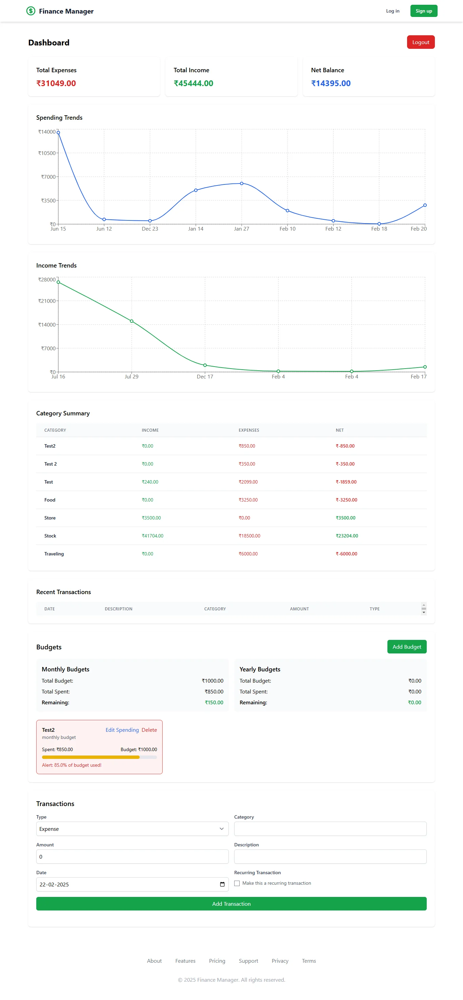

# Finance Manager Application

## 🚀 Live Demo
- Frontend: [https://expenses-track-frontend.vercel.app](https://expenses-track-frontend.vercel.app)

<br />



## 🛠️ Tech Stack
- Frontend: React + TypeScript + Vite
- State Management: Redux Toolkit
- Styling: Tailwind CSS

## 📌 Features
- User Authentication
- Transaction Management
- Budget Tracking
- Category-wise Expense Analysis
- Monthly/Yearly Reports
- Budget Alerts

## 🔧 Installation

### Prerequisites
- Node.js >= 16
- pnpm >= 9
- MongoDB >= 6

### Frontend Setup
```bash
# Clone the repository
git clone https://github.com/joy095/Expenses-Track-Frontend

# Navigate to server directory
cd Expenses-Track-Frontend

# Install dependencies
pnpm install

# Create environment file
cp .env.example .env

# Start development server
pnpm dev
```

### Frontend (.env)
```env
VITE_API_URL=http://localhost:5000
```

### Frontend
```
client/
├── src/
│   ├── components/
│   ├── pages/
│   ├── services/
│   ├── store/
│   └── App.tsx
├── tests/
└── package.json
```